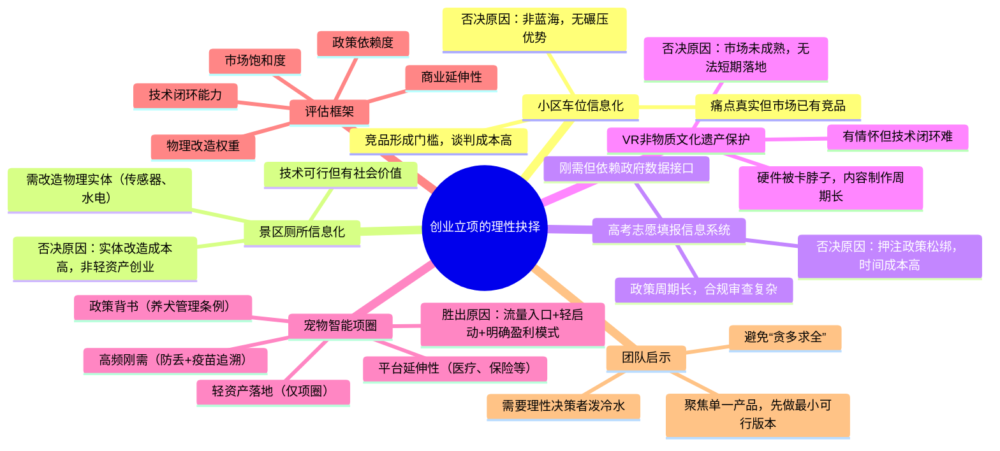

# 会议思维导图

```mermaid
mindmap
root((创业立项的理性抉择))
  小区车位信息化
    痛点真实但市场已有竞品
    竞品形成门槛，谈判成本高
    否决原因：非蓝海，无碾压优势
  景区厕所信息化
    技术可行但有社会价值
    需改造物理实体（传感器、水电）
    否决原因：实体改造成本高，非轻资产创业
  高考志愿填报信息系统
    刚需但依赖政府数据接口
    政策周期长，合规审查复杂
    否决原因：押注政策松绑，时间成本高
  VR非物质文化遗产保护
    有情怀但技术闭环难
    硬件被卡脖子，内容制作周期长
    否决原因：市场未成熟，无法短期落地
  宠物智能项圈
    轻资产落地（仅项圈）
    高频刚需（防丢+疫苗追溯）
    平台延伸性（医疗、保险等）
    政策背书（养犬管理条例）
    胜出原因：流量入口+轻启动+明确盈利模式
  评估框架
    市场饱和度
    物理改造权重
    政策依赖度
    技术闭环能力
    商业延伸性
  团队启示
    需要理性决策者泼冷水
    聚焦单一产品，先做最小可行版本
    避免“贪多求全”
```