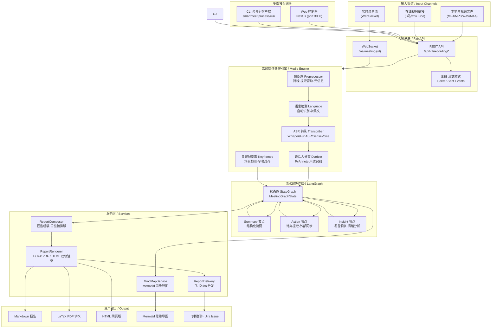
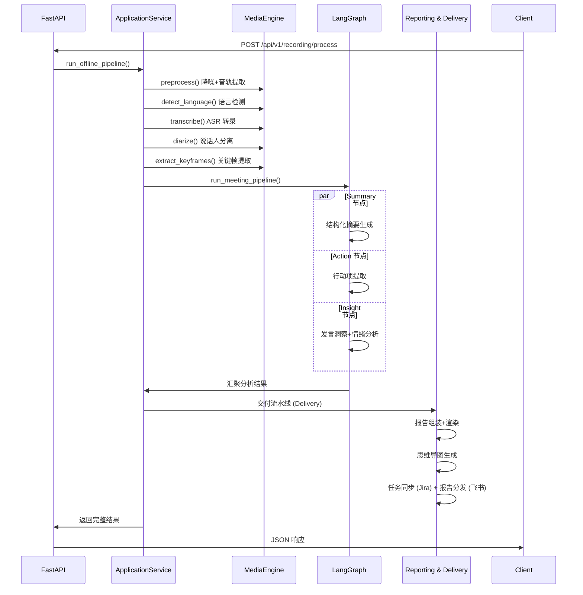
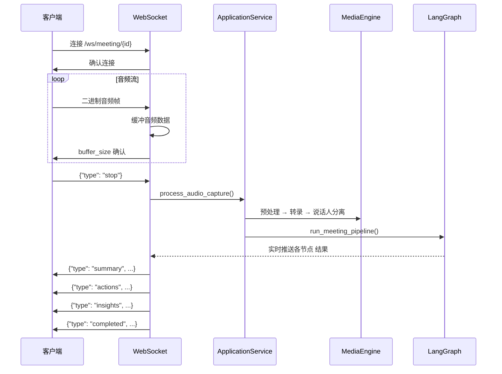
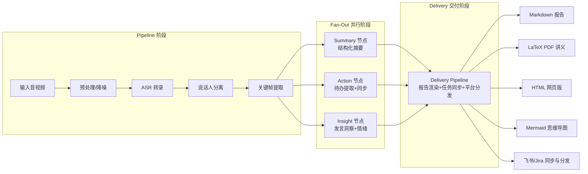
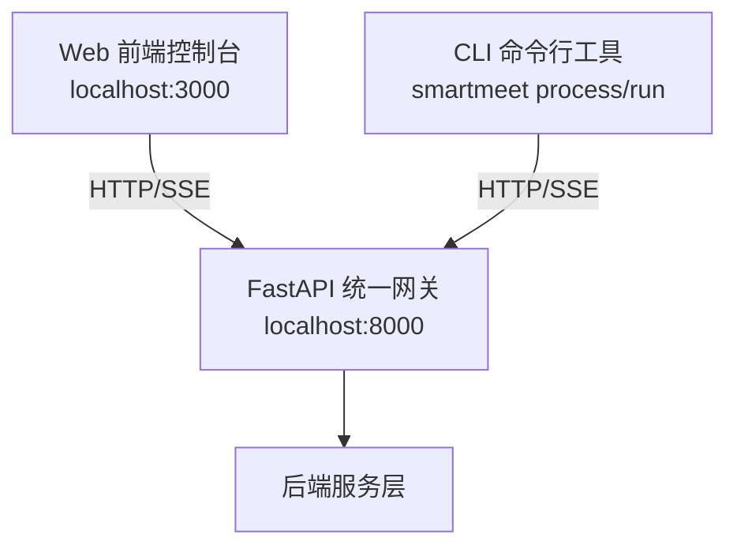

# SmartMeet 架构设计

## 一、系统概述

SmartMeet 是一个基于大模型的企业级智能会议自动化流水线。它通过 **LangGraph 流水线编排** 与 **音视频媒体处理引擎** 的深度融合，实现从原始音视频输入到结构化报告、待办同步、资产分发的全自动化闭环。

### 核心设计原则

- **Pipeline + Fan-out/Fan-in 编排**：媒体处理阶段严格串行（Pipeline），LLM 节点分析阶段并行执行（Fan-out），最终汇聚到 交付与分发管线（Fan-in）。
- **Schema-First 数据契约**：节点间传递的结构化数据通过 Pydantic 模型定义，模块边界从"约定"变为"接口"约束。
- **LLM 客户端统一注入**：所有节点 统一通过构造函数注入由 `create_llm_client()` 工厂创建的客户端，支持 OpenAI/DeepSeek/MiniMax/Cloudflare Workers AI 等多厂商。
- **Fail-Fast 与显式降级**：核心链路失败直接报错；非核心链路降级时记录显式日志和状态标记，禁止静默失败。

---

## 二、顶层架构图



---

## 三、模块职责

### 3.1 API 网关层 `interfaces/api/`

| 模块 | 职责 |
|------|------|
| [interfaces/api/main.py](file:///d:/Workspace/agent-project/smartmeet-agent-suite/interfaces/api/main.py) | FastAPI 入口，注册路由、CORS 中间件、静态文件服务 |
| [interfaces/api/routes/recording.py](file:///d:/Workspace/agent-project/smartmeet-agent-suite/interfaces/api/routes/recording.py) | 音视频处理核心入口：文件上传、离线处理（含流式进度推送与异步后台任务） |
| [interfaces/api/routes/analyze.py](file:///d:/Workspace/agent-project/smartmeet-agent-suite/interfaces/api/routes/analyze.py) | 原子化分析接口：仅运行 AI Agent 提取摘要、待办和洞察（不含音视频处理与排版） |
| [interfaces/api/routes/deliver.py](file:///d:/Workspace/agent-project/smartmeet-agent-suite/interfaces/api/routes/deliver.py) | 纯交付接口：接受分析结果并执行渲染、思维导图生成与飞书/Jira 分发 |
| [interfaces/api/routes/render.py](file:///d:/Workspace/agent-project/smartmeet-agent-suite/interfaces/api/routes/render.py) | 原子化渲染接口：根据分析结果排版生成 PDF/Markdown/思维导图报告 |
| [interfaces/api/routes/tasks.py](file:///d:/Workspace/agent-project/smartmeet-agent-suite/interfaces/api/routes/tasks.py) | 异步任务管理：用于轮询查询离线异步处理任务状态 |
| [interfaces/api/routes/websocket.py](file:///d:/Workspace/agent-project/smartmeet-agent-suite/interfaces/api/routes/websocket.py) | 实时录音 WebSocket 接口，接收音频流并触发完整流水线 |
| [interfaces/api/routes/config.py](file:///d:/Workspace/agent-project/smartmeet-agent-suite/interfaces/api/routes/config.py) | 系统配置管理接口：读写系统级环境变量与检测集成服务状态 |
| [interfaces/api/routes/reports.py](file:///d:/Workspace/agent-project/smartmeet-agent-suite/interfaces/api/routes/reports.py) | 历史报告管理接口：查看、删除会议产物，及音频文件流服务 |

### 3.2 媒体处理引擎 `services/media_engine/`

| 模块 | 职责 |
|------|------|
| [preprocessor.py](file:///d:/Workspace/agent-project/smartmeet-agent-suite/services/media_engine/preprocessor.py) | 音频降噪、音轨提取、时长与视频元信息获取 |
| [transcriber.py](file:///d:/Workspace/agent-project/smartmeet-agent-suite/services/media_engine/transcriber.py) | ASR 语音识别（支持 Faster-Whisper / FunASR / SenseVoice 多引擎） |
| [diarizer.py](file:///d:/Workspace/agent-project/smartmeet-agent-suite/services/media_engine/diarizer.py) | 说话人声纹分离（PyAnnote），将文本按发言人分段对齐 |
| [frames.py](file:///d:/Workspace/agent-project/smartmeet-agent-suite/services/media_engine/frames.py) | 基于场景检测的关键帧提取 + 字幕时间线对齐 |
| [subtitle.py](file:///d:/Workspace/agent-project/smartmeet-agent-suite/services/media_engine/subtitle.py) | 字幕数据结构与解析器，处理 SRT 与时间戳转换 |
| [downloader.py](file:///d:/Workspace/agent-project/smartmeet-agent-suite/services/media_engine/downloader.py) | yt-dlp 封装，支持 YouTube/Bilibili 等平台的音视频下载 |
| [parser.py](file:///d:/Workspace/agent-project/smartmeet-agent-suite/services/media_engine/parser.py) | 在线链接解析，识别平台类型与资源格式 |

### 3.3 流水线协作层 `agents/` + `workflows/`

| 模块 | 职责 |
|------|------|
| [workflows/meeting_workflow.py](file:///d:/Workspace/agent-project/smartmeet-agent-suite/workflows/meeting_workflow.py) | LangGraph `StateGraph` 编排定义：Fan-out 并行 + Fan-in 汇聚 |
| [agents/summary_agent.py](file:///d:/Workspace/agent-project/smartmeet-agent-suite/agents/summary_agent.py) | 从转写文本生成结构化会议纪要，内部集成 **Map-Reduce** 架构实现超长文本的分块并发与容错处理 |
| [agents/action_agent.py](file:///d:/Workspace/agent-project/smartmeet-agent-suite/agents/action_agent.py) | 提取行动项（谁/做什么/截止时间） |
| [agents/insight_agent.py](file:///d:/Workspace/agent-project/smartmeet-agent-suite/agents/insight_agent.py) | 发言统计、情绪分析、效率评分、关键词提取 |
| [agents/speaker_inference_agent.py](file:///d:/Workspace/agent-project/smartmeet-agent-suite/agents/speaker_inference_agent.py) | 根据对话上下文推断匿名发言人的真实姓名，执行全局身份替换 |
| [schemas/](file:///d:/Workspace/agent-project/smartmeet-agent-suite/schemas/) | Pydantic 数据契约层，包括 `meeting_schemas.py`, `job_config.py`, `meeting_state.py`, `task_schema.py` |

### 3.4 服务层 `services/`

| 模块 | 职责 |
|------|------|
| [services/pipeline/](file:///d:/Workspace/agent-project/smartmeet-agent-suite/services/pipeline/) | 应用编排层：分 `offline_processor.py` (离线处理) 和 `online_processor.py` (流式处理)，统一调度媒体引擎与工作流 |
| [services/core/task_queue.py](file:///d:/Workspace/agent-project/smartmeet-agent-suite/services/core/task_queue.py) , [task_service.py](file:///d:/Workspace/agent-project/smartmeet-agent-suite/services/core/task_service.py) , [task_model.py](file:///d:/Workspace/agent-project/smartmeet-agent-suite/services/core/task_model.py) | 异步任务处理队列、数据模型与状态持久化管理，底层基于 Arq 与 Redis，支持独立 Worker 后台可靠投递 |
| [services/core/checkpoint_service.py](file:///d:/Workspace/agent-project/smartmeet-agent-suite/services/core/checkpoint_service.py) | 分析及渲染产物进度存储，用于解耦各个 Pipeline 阶段的数据持久化 |
| [services/integrations/llm_client.py](file:///d:/Workspace/agent-project/smartmeet-agent-suite/services/integrations/llm_client.py) | 统一 LLM 客户端（OpenAI 兼容），支持异步/同步/流式调用 |
| [services/integrations/jira_client.py](file:///d:/Workspace/agent-project/smartmeet-agent-suite/services/integrations/jira_client.py) | Jira Cloud REST API 集成 |
| [services/integrations/feishu_client.py](file:///d:/Workspace/agent-project/smartmeet-agent-suite/services/integrations/feishu_client.py) | 飞书 Open API 集成（消息推送/文件上传） |
| [services/integrations/action_sync.py](file:///d:/Workspace/agent-project/smartmeet-agent-suite/services/integrations/action_sync.py) | 行动项幂等同步（从 ActionAgent 拆分出的外部同步逻辑） |
| [services/document_engine/pdf_engine.py](file:///d:/Workspace/agent-project/smartmeet-agent-suite/services/document_engine/pdf_engine.py) | LaTeX PDF 排版渲染 |
| [services/document_engine/html_engine.py](file:///d:/Workspace/agent-project/smartmeet-agent-suite/services/document_engine/html_engine.py) | HTML 网页报告排版渲染 |
| [services/document_engine/markdown_parser.py](file:///d:/Workspace/agent-project/smartmeet-agent-suite/services/document_engine/markdown_parser.py) | 轻量级自定义 Markdown 到 LaTeX 的语法解析转换 |
| [services/document_engine/mindmap_engine.py](file:///d:/Workspace/agent-project/smartmeet-agent-suite/services/document_engine/mindmap_engine.py) | Mermaid 思维导图生成引擎 |
| [services/reporting/](file:///d:/Workspace/agent-project/smartmeet-agent-suite/services/reporting/) | 报告组装（ReportComposer）、Markdown格式化（MarkdownFormatter）、渲染（ReportRenderer）、脑图（MindMapService） |
| [services/delivery/](file:///d:/Workspace/agent-project/smartmeet-agent-suite/services/delivery/) | 多渠道分发服务（飞书群聊/Jira Issue 附件挂载及通用 Webhook） |

### 3.5 多端网关

| 模块 | 职责 | 技术栈 |
|------|------|--------|
| [frontend/](file:///d:/Workspace/agent-project/smartmeet-agent-suite/frontend/) | 前端控制台 | Next.js 14 + React + TailwindCSS |
| [interfaces/cli/](file:///d:/Workspace/agent-project/smartmeet-agent-suite/interfaces/cli/) | 命令行客户端 | Python Click + Rich |

---

## 四、核心数据流

### 4.1 离线文件/链接处理流程



### 4.2 实时录音 WebSocket 流程



---

## 五、节点协作模式



### 节点间数据契约

| 数据模型 | 来源 Agent | 消费方 | 核心字段 |
|----------|-----------|--------|----------|
| [SummaryOutput](file:///d:/Workspace/agent-project/smartmeet-agent-suite/schemas/meeting_schemas.py#L24-L31) | SummaryAgent | Delivery Pipeline | title, date, participants, topics, decisions, next_steps |
| [ActionOutput](file:///d:/Workspace/agent-project/smartmeet-agent-suite/schemas/meeting_schemas.py#L50-L54) | ActionAgent | Delivery Pipeline | meeting_id, action_items, sync_status |
| [InsightOutput](file:///d:/Workspace/agent-project/smartmeet-agent-suite/schemas/meeting_schemas.py#L66-L74) | InsightAgent | Delivery Pipeline | overall_sentiment, speaker_stats, efficiency_score, keywords |

---

## 六、LLM 客户端统一注入

所有节点 通过构造函数接收统一的 `UnifiedLLMClient` 实例，由工厂方法 `create_llm_client()` 创建：

```python
from services.integrations.llm_client import create_llm_client

llm = create_llm_client(
    api_key="sk-xxx",          # 默认从 LLM_API_KEY 环境变量读取
    base_url="https://...",    # 默认从 LLM_BASE_URL 读取
    model="gpt-4o-mini",       # 默认从 LLM_MODEL 读取
)
```

**支持的厂商**：
- OpenAI (`gpt-4o`, `gpt-4o-mini`)
- DeepSeek (`deepseek-chat`)
- MiniMax (需配置 `MINIMAX_GROUP_ID`)
- Cloudflare Workers AI (`@cf/meta/llama-3-8b-instruct`)

---

## 七、多端接入架构



三种接入方式共享同一套后端服务，体现"多端解耦"设计理念。

---

## 八、目录结构总览

```
smartmeet-agent-suite/
├── interfaces/                 # 多端接入接口层
│   ├── api/                    # FastAPI 网关层
│   │   ├── main.py             # 入口与路由注册
│   │   └── routes/
│   │       ├── analyze.py      # 原子化分析 API
│   │       ├── deliver.py      # 纯交付 API
│   │       ├── recording.py    # 核心入口：离线处理及任务分发
│   │       ├── render.py       # 原子化渲染 API
│   │       ├── tasks.py        # 异步任务查询 API
│   │       ├── websocket.py    # 实时录音 WebSocket
│   │       ├── config.py       # 系统配置管理 API
│   │       └── reports.py      # 历史报告管理 API
│   ├── cli/                    # CLI 命令行客户端
│   │   └── main.py
│   └── web/                    # Web 前端控制台
│       ├── src/app/page.tsx
│       └── package.json
├── agents/                     # 流水线协作层
│   ├── summary_agent.py        # 摘要 Agent
│   ├── action_agent.py         # 待办 Agent
│   ├── insight_agent.py        # 洞察 Agent
│   └── speaker_inference_agent.py # 发言人推断 Agent
├── workflows/
│   └── meeting_workflow.py     # LangGraph 状态图编排
├── schemas/                    # Pydantic 数据契约
│   ├── meeting_schemas.py      # 节点间传递的结构化数据类型
│   ├── job_config.py           # 任务与系统配置
│   ├── meeting_state.py        # LangGraph 会议状态图模型
│   └── task_schema.py          # 异步任务 API Schema
├── services/                   # 服务层
│   ├── pipeline/               # 应用编排管线 (offline_processor, online_processor)
│   ├── core/                   # 核心基础服务
│   │   ├── task_queue.py       # 异步任务队列服务
│   │   ├── task_service.py     # 任务管理服务
│   │   ├── task_model.py       # 任务数据库模型
│   │   └── checkpoint_service.py # 状态数据持久化服务
│   ├── media_engine/           # 媒体处理引擎
│   │   ├── preprocessor.py     # 降噪/提取音轨
│   │   ├── transcriber.py      # ASR 语音识别
│   │   ├── diarizer.py         # 说话人分离
│   │   ├── frames.py           # 关键帧提取
│   │   ├── subtitle.py         # 字幕数据解析与时间戳转换
│   │   ├── downloader.py       # 音视频下载
│   │   └── parser.py           # 链接解析
│   ├── document_engine/        # 文档生成引擎
│   │   ├── pdf_engine.py       # LaTeX 排版渲染
│   │   ├── html_engine.py      # HTML 排版渲染
│   │   ├── markdown_parser.py  # Markdown 到 LaTeX 的自定义解析
│   │   └── mindmap_engine.py   # 思维导图
│   ├── integrations/           # 第三方集成
│   │   ├── llm_client.py       # 统一 LLM 客户端
│   │   ├── jira_client.py      # Jira 集成
│   │   ├── feishu_client.py    # 飞书集成
│   │   └── action_sync.py      # 行动项同步
│   ├── reporting/              # 报告组装 (Composer)、Markdown格式化、渲染 (Renderer)
│   └── delivery/               # 多渠道分发 (Delivery) 与 Webhook 服务
├── workers/                    # 异步任务 Worker 进程
│   └── arq_worker.py           # Arq 任务消费节点
├── assets/                     # CSS/LaTeX 模板文件
├── tests/                      # 测试套件
├── docs/                       # 文档
├── .env.example                # 环境变量模板
├── environment.yml             # Conda 环境依赖
└── pyproject.toml              # Python 项目配置
```