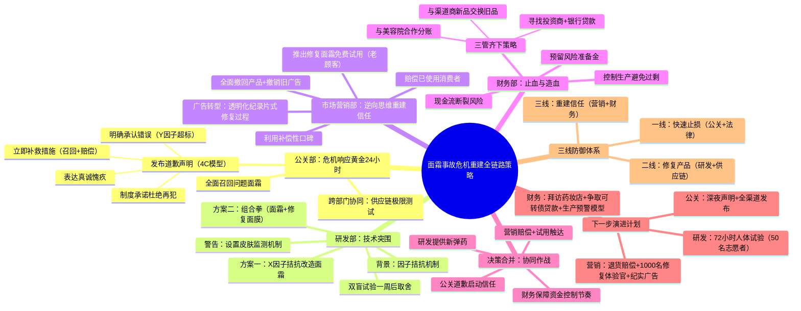

# 会议思维导图

```mermaid
mindmap
root((面霜事故危机重建全链路策略))
  公关部：危机响应黄金24小时
    全面召回问题面霜
    发布道歉声明（4C模型）
      明确承认错误（Y因子超标）
      表达真诚愧疚
      立即补救措施（召回+赔偿）
      制度承诺杜绝再犯
    跨部门协同：供应链极限测试
  研发部：技术突围
    方案一：X因子拮抗改造面霜
    方案二：组合拳（面霜+修复面膜）
    背景：因子拮抗机制
    双盲试验一周后取舍
    警告：设置皮肤监测机制
  市场营销部：逆向思维重建信任
    全面撤回产品+撤销旧广告
    赔偿已使用消费者
    推出修复面霜免费试用（老顾客）
    利用补偿性口碑
    广告转型：透明化纪录片式修复过程
  财务部：止血与造血
    现金流断裂风险
    三管齐下策略
      与渠道商新品交换旧品
      与美容院合作分账
      寻找投资商+银行贷款
    控制生产避免过剩
    预留风险准备金
  决策合并：协同作战
    公关道歉启动信任
    研发提供新弹药
    营销赔偿+试用触达
    财务保障资金控制节奏
  下一步演进计划
    公关：深夜声明+全渠道发布
    研发：72小时人体试验（50名志愿者）
    营销：退货赔偿+1000名修复体验官+纪实广告
    财务：拜访药妆店+争取可转债贷款+生产预警模型
  三线防御体系
    一线：快速止损（公关+法律）
    二线：修复产品（研发+供应链）
    三线：重建信任（营销+财务）
```