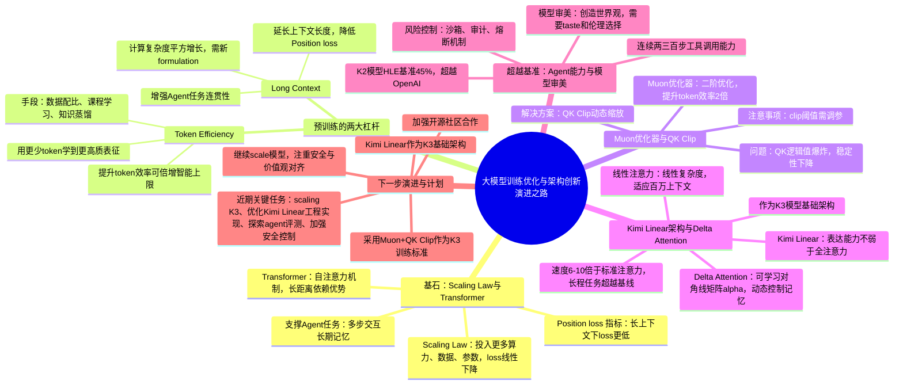

# 会议思维导图

```mermaid
mindmap
root((大模型训练优化与架构创新演进之路))
  基石：Scaling Law与Transformer
    Scaling Law：投入更多算力、数据、参数，loss线性下降
    Transformer：自注意力机制，长距离依赖优势
    Position loss 指标：长上下文下loss更低
    支撑Agent任务：多步交互长期记忆
  预训练的两大杠杆
    Token Efficiency
      用更少token学到更高质表征
      手段：数据配比、课程学习、知识蒸馏
      提升token效率可倍增智能上限
    Long Context
      延长上下文长度，降低Position loss
      增强Agent任务连贯性
      计算复杂度平方增长，需新formulation
  Muon优化器与QK Clip
    Muon优化器：二阶优化，提升token效率2倍
    问题：QK逻辑值爆炸，稳定性下降
    解决方案：QK Clip动态缩放
    注意事项：clip阈值需调参
  Kimi Linear架构与Delta Attention
    线性注意力：线性复杂度，适应百万上下文
    Kimi Linear：表达能力不弱于全注意力
    Delta Attention：可学习对角线矩阵alpha，动态控制记忆
    速度6-10倍于标准注意力，长程任务超越基线
    作为K3模型基础架构
  超越基准：Agent能力与模型审美
    K2模型HLE基准45%，超越OpenAI
    连续两三百步工具调用能力
    模型审美：创造世界观，需要taste和伦理选择
    风险控制：沙箱、审计、熔断机制
  下一步演进与计划
    采用Muon+QK Clip作为K3训练标准
    Kimi Linear作为K3基础架构
    继续scale模型，注重安全与价值观对齐
    加强开源社区合作
    近期关键任务：scaling K3、优化Kimi Linear工程实现、探索agent评测、加强安全控制
```