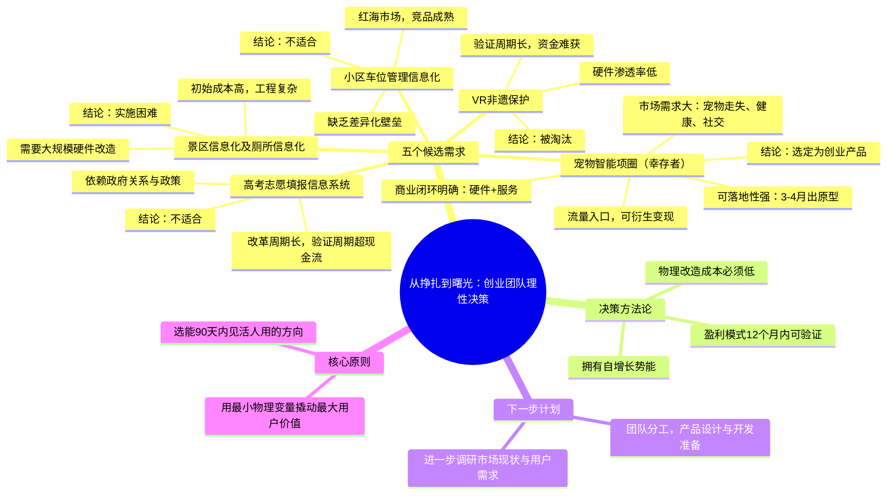

# 会议思维导图

```mermaid
mindmap
  root((从挣扎到曙光：创业团队理性决策))
    五个候选需求
      小区车位管理信息化
        红海市场，竞品成熟
        缺乏差异化壁垒
        结论：不适合
      高考志愿填报信息系统
        依赖政府关系与政策
        改革周期长，验证周期超现金流
        结论：不适合
      景区信息化及厕所信息化
        需要大规模硬件改造
        初始成本高，工程复杂
        结论：实施困难
      VR非遗保护
        硬件渗透率低
        验证周期长，资金难获
        结论：被淘汰
      宠物智能项圈（幸存者）
        商业闭环明确：硬件+服务
        可落地性强：3-4月出原型
        市场需求大：宠物走失、健康、社交
        流量入口，可衍生变现
        结论：选定为创业产品
    决策方法论
      物理改造成本必须低
      盈利模式12个月内可验证
      拥有自增长势能
    下一步计划
      进一步调研市场现状与用户需求
      团队分工，产品设计与开发准备
    核心原则
      用最小物理变量撬动最大用户价值
      选能90天内见活人用的方向
```